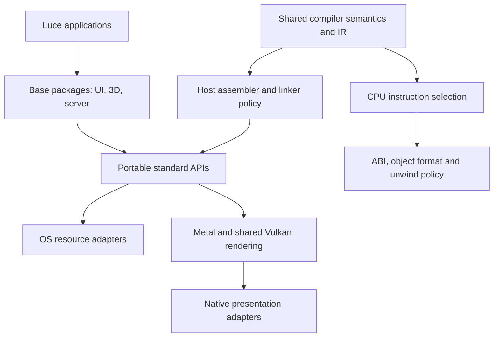

# Platform boundaries

Native code generation is the normal build path. Luce lowers to Base; Base lowers
to shared IR and then native assembly. The C backend supplies bootstrap snapshots
and an independent execution oracle.

## Compiler and host tools

- `back/target.lucb` describes target facts, including OS, CPU, C data layout and
  system linkage. Shared checking and optimization consume those facts.
- `back/native/arm64.lucb` and `back/native/x86_64.lucb` select instructions. The
  x86 backend delegates calling conventions, object-format policy and unwind
  records to `back/native/x86_64/{abi,object,unwind}.lucb`.
- `back/native/dwarf.lucb` describes source locations and types for both CPUs.
  Mach-O uses dSYM output, ELF uses a debug sidecar, and PE embeds DWARF alongside
  its independent SEH unwind information.
- `support/host_tools.lucb` owns assembler/linker policy and build workspaces.
  Filesystem paths, directory ownership and private child process settings come
  from standard `files` and `process` APIs. Common compiler modules do not call
  Win32 or POSIX filesystem APIs directly.
- `support/arena.lucb` owns stable, growing command storage. Its capacity follows
  the command's allocation requirements on every OS.

Host-tool workspaces sit beside their destination. Tools receive relative names
for generated inputs and outputs, an explicit child working directory, and private
temporary-directory environment settings. GCC intermediates stay in that owned
directory on Windows. Publication uses the standard filesystem API, and cleanup
removes the complete workspace. No short-name alias or process-wide environment
mutation is required. External C sources and library paths still follow the
selected external toolchain's filename support.

The Windows driver policy follows GCC's
[temporary-file implementation](https://github.com/gcc-mirror/gcc/blob/master/libiberty/make-temp-file.c)
and [intermediate-output options](https://gcc.gnu.org/onlinedocs/gcc/Overall-Options.html).

Standard-library reachability includes storage as well as functions. Removing an
unused platform adapter must not reserve its globals or thread-local buffers on
another target. Initializers, referenced addresses, assembly references, explicit
retention attributes and application linkage remain roots.

## Standard APIs and packages

The standard library owns native resources and their lifetimes. Shared Win32 ABI
declarations and UTF-8/UTF-16 conversions live in `std/windows_abi.lucb` and
`std/windows_text.lucb`; module-specific native operations stay with the relevant
standard module.

`files.TemporaryDirectory` owns temporary filesystem state. `process.run` can set
a child's working directory and environment without changing its parent.
`process.Termination` owns a notification subscription. On Windows console close,
the native callback waits for subscription owners to acknowledge cleanup, subject
to a bounded deadline. Server request draining and worker joins belong to
`luce-server`, above that notification mechanism.

UI and 3D packages use the portable `window` and `gpu` APIs. The Vulkan backend
shares device, resource, pipeline and rendering code; its `presentation` adapter
supplies native surfaces and presentation support. Win32 is the current Vulkan
presentation adapter. Metal is the macOS GPU backend. Linux window presentation
and Vulkan rendering remain future adapters; CPU and server support on Linux are
implemented and validated independently.

## Validation boundaries

`tools/test_platform_boundaries.py` guards the compiler host-tool, Vulkan
presentation and x86 object/unwind boundaries. Runtime tests cover ownership,
failure cleanup, Unicode paths and interop. Independent C ABI oracles check native
calling conventions and Vulkan SDK layouts; Windows GDB checks source breakpoints,
typed locals and backtraces. Each platform also checks fresh Seed bootstrap and
native self-hosting.

Hosted CPU/SDK checks do not establish graphics-driver behavior. Actual Metal
rendering is exercised locally with the UI and 3D demos. Windows Vulkan rendering
requires a Vulkan-capable machine; its SDK ABI checks run in hosted CI.
